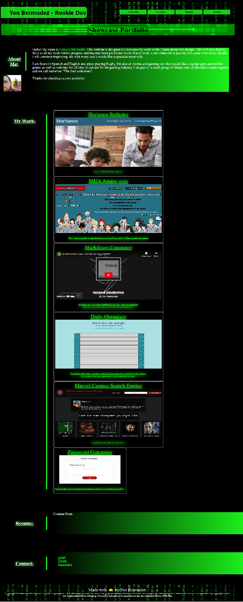

# Yon B. My Showcase Portfolio

## Description

- This site served as my first project building a website from the ground up. I tried to apply as many concepts 
as possible within the given time also keeping a homogeneus style and easy read.

- It will also serve as a hub for future projects and a lab of sorts to experiment with new concepts.

- My main focus during this project was to get a better understanding of web design, responsiveness and how sites are shown to the viewer on different screen sizes.

## Technical Skills

## Table of Contents (Optional)

If your README is long, add a table of contents to make it easy for users to find what they need.

- [Access](#access)
- [Visuals](#visuals)
- [Credits](#credits)
- [License](#license)
- [Features](#features)
- [How to Contribute](#how-to-contribute)

## Access

- The link to my Github repository: https://github.com/EvolanGIT/YBDportfolio
- The launched website: https://evolangit.github.io/YBDportfolio/

## Visuals

This is the screenshot of the full-size website portfolio.
    

    

## Credits

- Melany Pietrowski https://github.com/Melpie10 for all your constructive 
comments and infinite patience when a concept proves difficult to understand.

-The four Codesmen- (myself being one of)
- Edwin Pietrowski https://github.com/BogartDME
- Denart Ifurung https://github.com/difurung
- Charles Beatty https://github.com/beattycharles
- UNCC coding bootcamp TA's for all their insight and help with concepts.

## License

Copyright (c) [2022] [Yonatan Yael Bermudez Diez]

## Features

-Responsive Design made to work in all screen sizes.
-Animated Buttons.
-Image Hyperlinks to my work.

## How to Contribute

Constructive Comments are always welcome. e-mail me: yon_baermund@hotmail.com

